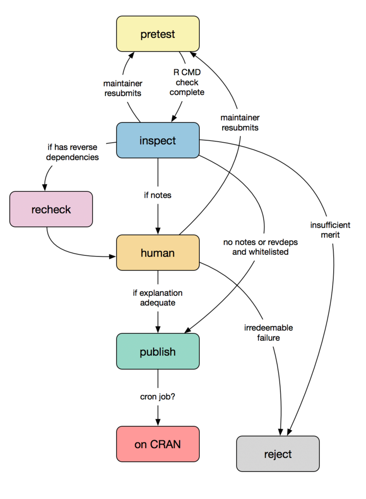

```{r setup, include=FALSE}
knitr::opts_chunk$set(echo = TRUE)

library(tidyverse)
library(lubridate)
library(ggalluvial)

incoming_df <- readRDS("data/incoming_df.RDS")
raw_data <- readRDS("data/raw_data.RDS")
tidy_incoming <- readRDS("data/tidy_incoming.RDS")
package_history <- readRDS("data/package_history.RDS")

```

-   [Approach](#approach)
-   [Insights](#insights)
-   [Assets](#assets)
     -   [Data](#data)
     -   [Scripts](#scripts)
-   [Quick Analysis](#quick-analysis)
     -   [Wait time histograms](#wait-time-histograms)
     -   [Package flow](#package-flow)


## Aproach

The approach was to record snapshots of the CRAN Incoming folder contents in a regular interval (ftp://cran.r-project.org/incoming/). Inside the Incoming folder, there are sub-folders that equate to the status in which the package is at that time.  Knowing when a given package enters and leaves a sub-folder, and where it goes after that, provides the information that we used to determine direction and duration of each package movement. 

During the exercise, we also matched the CRAN Incoming data with the CRAN package data to determine which packages ended up as published in CRAN, and make the assumption that those who didn't, and have no current status, were dropped by the CRAN review process. 

The team was able to make determinations of what the flow and timing looks like based on several visualizations, and by monitoring the changes over time.

## Insights

Hadley Wickham (@hadley) distilled our findings into the following diagram. Again, please note that this diagram is based on assumptions based on snapshots of the Incoming folder.  This is not the **official** CRAN process, just an analysis to help derive the current process:



## Assets

## Data

All of the data captured from 2/26/2018 to 3/20/2018. The files are available in the `data` folder  They are all filtered and/or transformed versions of the same source:

- `raw_data.RDS`- It contains the raw content of what was returned by the `curl` command, the time/date of the snapshot that line belongs to, and the sub-folder inside the **Incoming** folder it is located in.  The automated job was set to run every 15 minutes, so many contiguous snapshots will be either very similar or exactly the same:
    ```{r, echo = FALSE}
      glimpse(raw_data, width = 100)
    ```

- `incoming_df.RDS` - Adds two important fields to the raw data: an `is_package` flag, and the package's name if it is a package.  They way it identify packages is by checking if the file has the extension: `.tar.gz` 
    ```{r, echo = FALSE}
      glimpse(incoming_df, width = 100)
    ```

- `tidy_incoming.RDS` - Filtered version of `incoming_df`. It contains only those the entries for files identified as packages:
    ```{r, echo = FALSE}
      glimpse(tidy_incoming, width = 100)
    ```
  
- `package_history.RDS` - It compresses the snapshots from `tidy_incoming` into unique entries that *attempt* to identify when the package enters and leaves a given sub-folder, which is how the status is tracked.  
    ```{r, echo = FALSE}
    package_history %>%
      arrange(package, start) %>%
      glimpse(width = 100)
    ```

### Scripts

There are three R scripts included in this project.  They can be used to build your own snapshots and to compile them. They are also meant to provide more background about how the data that is shared in this project was captured and tabulated. All of the scripts are located in the R folder:

- `take-snapshot.R` - Code to capture and save a snapshot of the Incoming CRAN folder 
- `compile-snapshot.R`  - Code to merge all of the snapshots taken by the code in the `take_snapshot.R` script into one data set. It creates the `raw_data`, `incoming_df` and `tidy_incoming` tibbles.
- `package-history.R` - It creates the `package_history` tibble.  


## Quick analysis

The `package_history` data contains a pre-calculated version of the data that contains the number of minutes that the package spent in that specific folder, before either disappearing or moving to another folder.

```{r}
library(tidyverse)

steps <- 7
color_names <-  c("pretest", "publish", "inspect", "recheck", "human", "waiting")
color_values <- c("#F0E442", "#009E73", "#0072B2", "#CC79A7", "#E69F00", "gray")

package_history <- read_rds("data/package_history.RDS")

package_count <- package_history %>%
  group_by(package) %>%
  summarise() %>%
  nrow()

print(paste0("There were ", package_count, " packages tracked during the analysis"))
```

```{r}
history <- package_history %>%
  filter(subfolder != "waiting") %>%
  group_by(package) %>%
  arrange(start) %>% 
  mutate(
    step = row_number(),
    subfolder = ifelse(subfolder %in% c("SH", "UL", "KH"), "human", subfolder)
    ) %>%
  ungroup() %>% 
  arrange(package, step) %>%
  filter(step < steps) 

glimpse(history)
```

### Wait time histograms

```{r, fig.height = 5, fig.width = 10}
history %>%
  ggplot() +
  geom_histogram(
    aes(wait_minutes), 
    fill = "#ffb14e", 
    color = "white", 
    binwidth = 1000) +
  theme_minimal() +
  labs(title = "Wait time (In minutes)") +
  theme(axis.title = element_blank()) 
```

```{r, fig.height = 8, fig.width = 10}
history %>%
  ggplot() +
  geom_histogram(
    aes(wait_minutes), 
    fill = "#ffb14e", 
    color = "white", 
    binwidth = 1000) +
  facet_wrap(~subfolder, scales = "free") +
  theme_minimal() +
  labs(title = "Wait time by sub-folder") +
  theme(axis.title = element_blank()) 
  
```

```{r, fig.height = 8, fig.width = 10}
history %>%
  mutate(step = paste0("Step No. ", step)) %>%
  ggplot() +
  geom_histogram(
    aes(wait_minutes), 
    fill = "#ffb14e", 
    color = "white", 
    binwidth = 1000) +
  facet_wrap(~step, scales = "free") +
  theme_minimal() +
  labs(title = "Wait time by Step Number") +
  theme(axis.title = element_blank()) 
  
```

### Package flow 

```{r, fig.height = 8, fig.width = 10}

packages <- package_history %>%
  pull(package) %>%
  unique()

package_steps <- packages %>%
  map_df(~{
    tibble(
      package = .x,
      step = 1:steps
    )
  })


history %>%
  select(package, subfolder, step) %>%
  right_join(package_steps, by = c("package", "step"))  %>%
  mutate(
    subfolder = as.factor(subfolder),
    step = paste0("Step No. ", step)
    ) %>%
  ggplot(aes(x = step, 
             stratum = subfolder, 
             alluvium = package, 
             fill = subfolder, 
             label = subfolder, 
             color = subfolder)) +
    geom_flow(stat = "alluvium", lode.guidance = "rightleft", alpha = 0.2) +
    geom_stratum(alpha = 0.8, color = "white") +
    theme_minimal() +
    scale_fill_manual(
      limits = color_names, 
      values = color_values
    ) +
      scale_color_manual(
      limits = color_names, 
      values = color_values
    ) +
  scale_x_discrete(
    labels = c("Step No 1", "Step No 2", "Step No 3", "Step No 4", "Step No 5", "Step No 6")) +
  theme(legend.position = "bottom") +
  labs(title = "Package's sub-folder flow")
```


