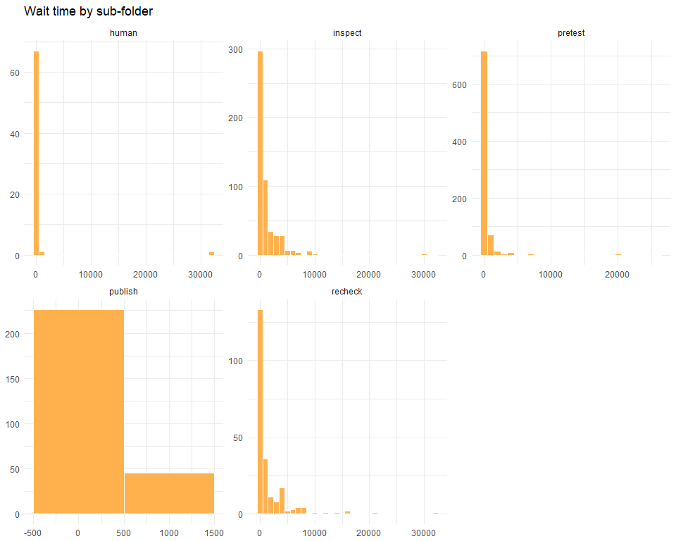
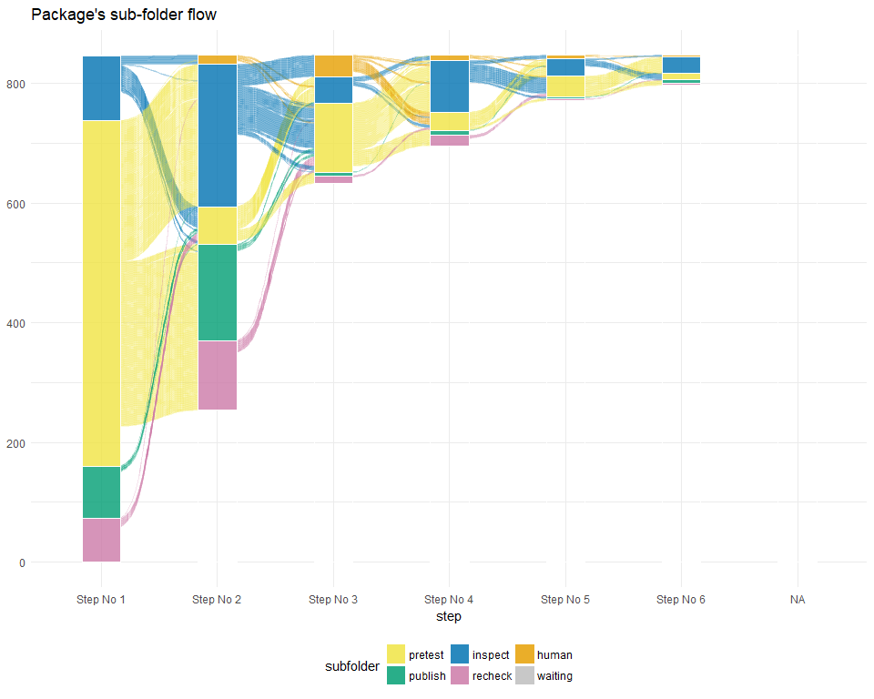

CRAN Analysis
================
Edgar Ruiz
4/25/2018

## Data

All of the data captured from 2/26 to 3/20 is available in the `data`
subfolder. They are all filted and/or transformed versions of the same
data.

## Quick glance

The `package_history` data contains a pre-calculated version of the data
that contains the number of minutes that the package spent in that
specific folder, before either disapearing or moving to another folder.

``` r
library(tidyverse)


package_history <- read_rds("data/package_history.RDS")

package_history %>%
  arrange(package, start) %>%
  select(package, subfolder, wait_minutes)
```

    ## # A tibble: 2,252 x 3
    ##    package     subfolder wait_minutes
    ##    <chr>       <chr>            <dbl>
    ##  1 A2          pretest             0.
    ##  2 A2          inspect          3495.
    ##  3 abnormality pretest         18210.
    ##  4 abnormality inspect          1380.
    ##  5 Ac3net      inspect            60.
    ##  6 Ac3net      pretest           660.
    ##  7 Ac3net      inspect            31.
    ##  8 ACMEeqtl    pretest             0.
    ##  9 ACMEeqtl    inspect           105.
    ## 10 acs         recheck            60.
    ## # ... with 2,242 more rows

``` r
steps <- 10
color_names <- c("inspect", "KH", "pretest", "publish", "recheck", "SH", "waiting", "UL")
color_values <- c("#F0E442", "#009E73", "#0072B2", "#CC79A7", "#E69F00", "gray", "red", "black")


history <- package_history %>%
  group_by(package) %>%
  arrange(start) %>% 
  mutate(step = row_number()) %>%
  ungroup() %>% 
  arrange(package, step) %>%
  filter(step < steps) 

history
```

    ## # A tibble: 1,982 x 6
    ##    package  subfolder start               end                 wait_minutes
    ##    <chr>    <chr>     <dttm>              <dttm>                     <dbl>
    ##  1 A2       pretest   2018-03-06 16:34:09 2018-03-06 16:34:09           0.
    ##  2 A2       inspect   2018-03-06 16:48:58 2018-03-09 03:04:26        3495.
    ##  3 abnorma~ pretest   2018-02-27 20:49:46 2018-03-12 12:19:19       18210.
    ##  4 abnorma~ inspect   2018-03-12 12:34:27 2018-03-13 11:34:14        1380.
    ##  5 Ac3net   inspect   2018-02-26 15:04:25 2018-02-26 16:04:32          60.
    ##  6 Ac3net   pretest   2018-02-28 19:04:30 2018-03-01 06:04:17         660.
    ##  7 Ac3net   inspect   2018-03-01 06:19:03 2018-03-01 06:49:38          31.
    ##  8 ACMEeqtl pretest   2018-03-06 14:49:12 2018-03-06 14:49:12           0.
    ##  9 ACMEeqtl inspect   2018-03-06 15:04:26 2018-03-06 16:48:58         105.
    ## 10 acs      recheck   2018-03-02 08:49:01 2018-03-02 09:49:04          60.
    ## # ... with 1,972 more rows, and 1 more variable: step <int>

``` r
history %>%
  ggplot() +
  geom_histogram(aes(wait_minutes), binwidth = 1000) +
  theme_minimal()
```

<!-- -->

``` r
history %>%
  ggplot() +
  geom_histogram(aes(wait_minutes), fill = "red", binwidth = 1000) +
  facet_grid(subfolder ~.) +
  theme_minimal()
```

<!-- -->

``` r
history %>%
  ggplot() +
  geom_histogram(aes(wait_minutes), fill = "red", binwidth = 1000) +
  facet_grid(step ~.) +
  theme_minimal()
```

<!-- -->

``` r
package_step <- history %>%
  group_by(step, subfolder) %>%
  summarise(
    median_wait = round(median(wait_minutes)),
    count = n()
    ) %>%
  mutate(step_name = paste0("step", step))
```

``` r
package_step %>%
  mutate(xlabel = ifelse(count > 200, prettyNum(count, ","), "")) %>%
  ggplot() +
  geom_col(aes(x = step_name, y = count, group = subfolder, fill = subfolder)) +
  geom_text(aes(x = step_name, y = count, label = xlabel)) +
  theme_void() +
  scale_fill_manual(
    limits = color_names, 
    values = color_values
  ) +
  scale_color_manual(
    limits = color_names, 
    values = color_values
  ) 
```

<!-- -->

``` r
package_step %>%
  mutate(xlabel = ifelse(median_wait > 5000, prettyNum(median_wait, ","), "")) %>%
  ggplot() +
  geom_col(aes(x = step_name, y = median_wait, group = subfolder, fill = subfolder)) +
  geom_text(aes(x = step_name, y = median_wait - 2000, label = xlabel)) +
  theme_void() +
  scale_fill_manual(
    limits = color_names, 
    values = color_values
  ) +
  scale_color_manual(
    limits = color_names, 
    values = color_values
  ) 
```

<!-- -->

``` r
packages <- package_history %>%
  pull(package) %>%
  unique()

package_steps <- packages %>%
  map_df(~{
    tibble(
      package = .x,
      step = 1:steps
    )
  })
```

``` r
history %>%
  select(package, subfolder, step) %>%
  right_join(package_steps, by = c("package", "step"))  %>%
  mutate(subfolder = as.factor(subfolder)) %>%
  ggplot(aes(x = step, 
             stratum = subfolder, 
             alluvium = package, 
             fill = subfolder, 
             label = subfolder, 
             color = subfolder)) +
    geom_flow(stat = "alluvium", lode.guidance = "rightleft", alpha = 0.2) +
    geom_stratum(alpha = 0.8, color = "white") +
    theme_void() +
    scale_fill_manual(
      limits = color_names, 
      values = color_values
    ) +
      scale_color_manual(
      limits = color_names, 
      values = color_values
    ) 
```

<!-- -->
